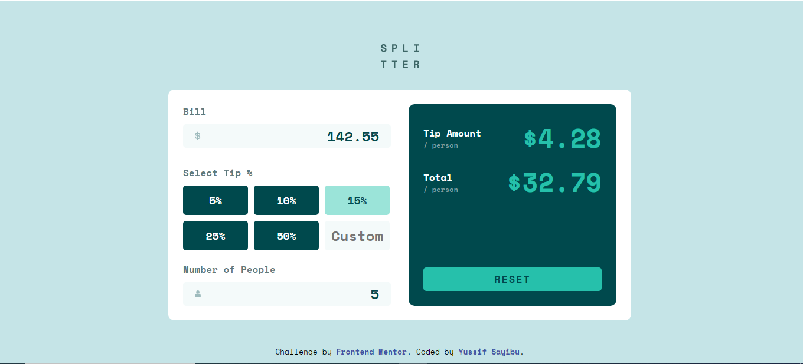

# Tip Calculator

## Table of Contents

- [About the App](#about-the-app)
- [Built With](#built-with)
- [My Process](#my-process)
- [What I've Learned](#what-ive-learned)

## About the App

The Tip Calculator is a web application designed to help users calculate tips and split bills among a group of people. With intuitive input fields and options for various tip percentages, the app simplifies the process of determining individual tip amounts and total bill splits.

## Built With

- HTML
- CSS
- JavaScript

## My Process

The development of the Tip Calculator involved several key steps:

1. **HTML and CSS**: I began by creating the user interface using HTML for structure and CSS for styling. The app features input fields for the bill amount, number of people, and custom tip percentage.

2. **Event Listeners**: I implemented JavaScript event listeners to capture user input and respond to changes in the input fields. These listeners trigger calculations and dynamically update the results on the page.

3. **Tip Calculation Logic**: The core of the app is the logic to calculate tip amounts based on selected percentages or custom input. The calculations ensure accurate results and handle edge cases such as empty or invalid inputs.

4. **Styling and Responsiveness**: I applied responsive design principles to ensure the app looks and functions well on various screen sizes. CSS was used to create an appealing and user-friendly interface.

5. **Testing and Debugging**: I thoroughly tested the app, considering different scenarios and inputs. I used debugging techniques to identify and resolve any issues that arose during testing.

6. **Documentation**: I created this README.md file to provide clear instructions on how to use the app, explain its features, and highlight the development process.

## What I've Learned

Developing the Tip Calculator has provided valuable learning experiences:

- **JavaScript DOM Manipulation**: I gained a deeper understanding of how to manipulate the Document Object Model (DOM) using JavaScript. This includes updating elements, handling user input, and responding to events.

- **Problem Solving**: I encountered various challenges during development, such as handling invalid inputs and ensuring accurate calculations. Solving these challenges improved my problem-solving skills and attention to detail.

- **Version Control**: I used version control (e.g., Git) to manage the project's codebase, track changes, and collaborate effectively. This experience enhanced my understanding of version control workflows.

## Author

- Frontend Mentor - (https://www.frontendmentor.io/profile/yussifsayibu)
- Tiktok - (https://www.tiktok.com/yuss.dev)